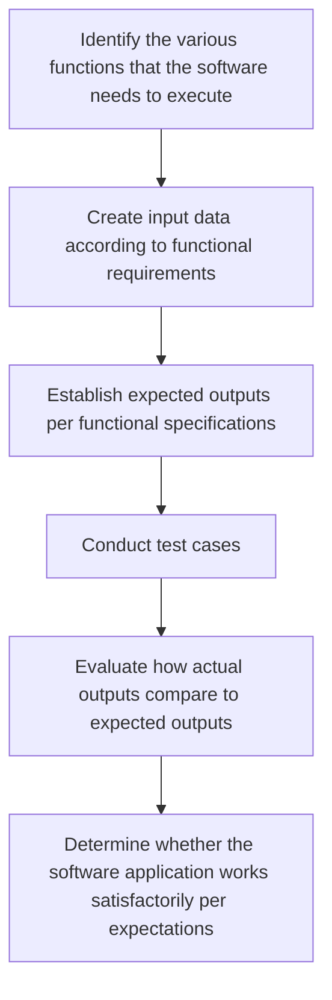

# Functional Tests

```mermaid
flowchart TD
    A[Identify the various functions that the software needs to execute]
    B[Create input data according to functional requirements]
    C[Establish expected outputs per functional specifications]
    D[Conduct test cases]
    E[Evaluate how actual outputs compare to expected outputs]
    F[Determine whether the software application works satisfactorily per expectations]

    A --> B --> C --> D --> E --> F
```
